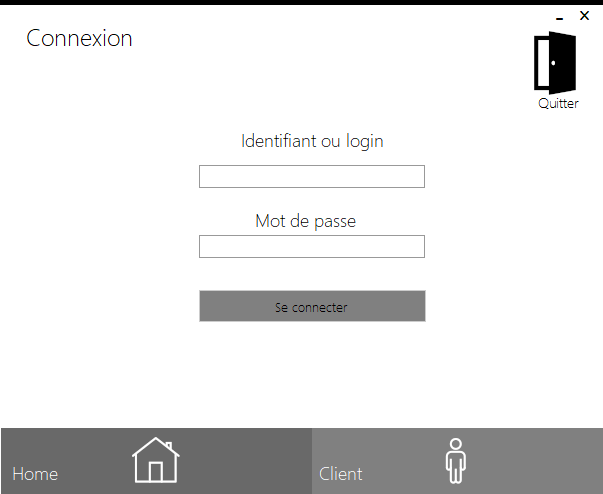
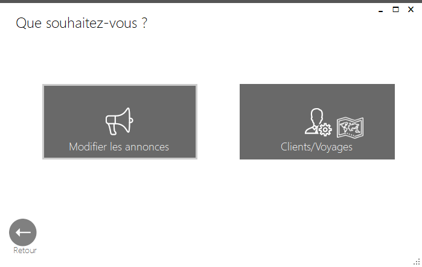
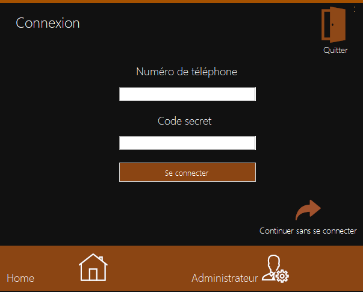
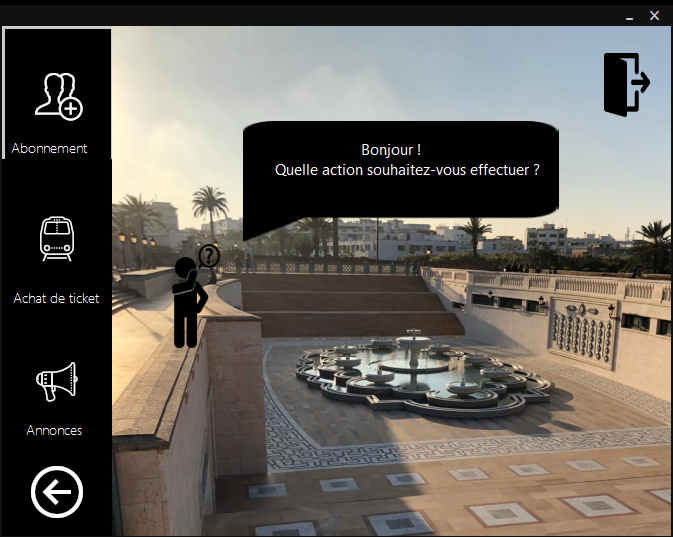

## Windows-Form-App
This repository contains a Windows Form App priorly made in order to complete a school project assignment.

## Screenshots 

> **Discover the other features by downloading the software ! ** :blush:
> **View all of README to fully discover the project. It is in fact short, but quite explicit ** :blush:

## About the project
The software language is French. It is mainly made in C#, though the links with the database is made with pure SQL queries. It was first in order to complete a school assignment, but I have deciced to upload it here to help some developpers not to do the exact same application, but for academic or project purposes by giving some patterns. Feel free to contribute, improve or criticize.

## Features
The project includes : 
- Client operations : trip booking/consulting, view annouces related to the past or incoming trips, account creation...
- Administrator operations: operations related to clients (add, remove, modify), trips (add, remove, modify) and annouces as well. 

## Pre-requisites & How to use :
To properly use it, you should first create a local MySQL schema which title will be "projet"; unless you do not desire a database connection,
but some features would be restricted. After installing, run the MySQL schema building script located [here](https://github.com/Justsecret123/Windows-Form-App/blob/master/Project/Mini-projet/bin/Debug/Projet_db.sql).

## Tools
- Languages : C#, SQL; 
- IDE: Microsoft Visual Studio 2017; 
- Database server: MySQL;
- Frameworks: MetroUIFramework.

